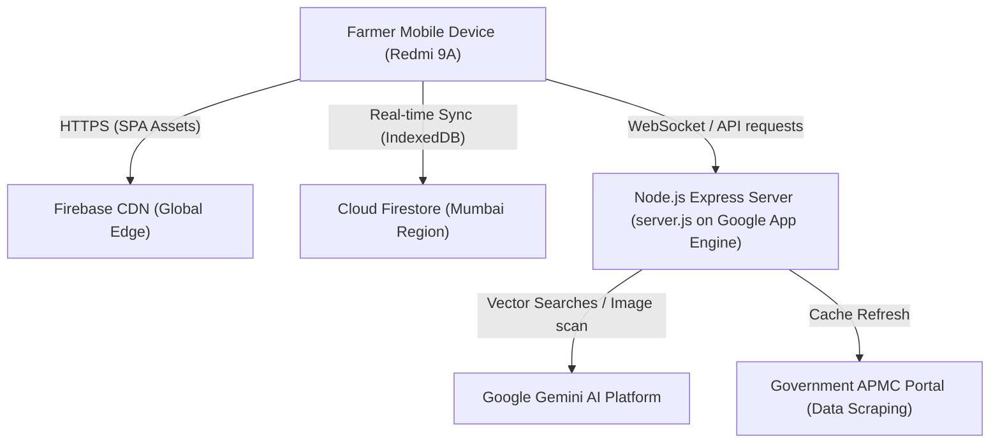

# AI Krushi Mitra — Deployment Topology

> **Version:** 1.0 | **Status:** Approved | **Owner:** DevOps Engineer  
> **Last Updated:** 2026-06-28

---

## 1. Network Topology Diagram

---

## 2. Infrastructure Specifications

1.  **Frontend CDN:** Firebase Hosting (handles all static SSR HTML pages and React bundle distribution).
2.  **API Backend:** Google App Engine (F1 standard instance hosting `server.js` Node.js server for WebSocket voice connections).
3.  **Database:** Cloud Firestore (Multi-region Mumbai location to minimize latency for Indian farmers).
4.  **Security Rules:** Whitelisted origin domains for Firebase Hosting and OAuth login APIs.
