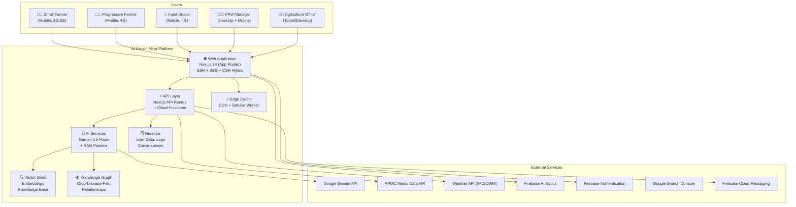

# AI Krushi Mitra — System Architecture

> **Version:** 1.0 | **Status:** Approved | **Owner:** Solution Architect  
> **Last Updated:** 2026-06-28

---

## 1. System Context (C4 Level 1)



---

## 2. Container Diagram (C4 Level 2)

### 2.1 Web Application (Next.js)

```
Next.js Application
├── Server-Side (Node.js)
│   ├── SSR Pages: Landing, About, Contact
│   ├── SSG Pages: Crop guides, Disease guides, Mandi Bhav, Schemes
│   ├── ISR Pages: Weather (30min), Market Prices (15min)
│   ├── API Routes: /api/v1/* (proxied to backend services)
│   └── Middleware: Auth check, rate limiting, locale detection
│
├── Client-Side (Browser)
│   ├── CSR App: /app/* (Dashboard, Voice, Scan, Market, Profile)
│   ├── State Management: Zustand stores
│   ├── Service Worker: Offline caching, background sync
│   └── Firebase SDK: Auth, Firestore, Analytics
│
└── Static Assets
    ├── Design System: CSS tokens, component styles
    ├── Images: WebP optimized, lazy-loaded
    ├── Icons: SVG sprite sheet
    └── Fonts: Plus Jakarta Sans, Inter (subset)
```

### 2.2 Backend Services

```
Backend Layer
├── API Gateway (Next.js API Routes)
│   ├── /api/v1/chat          → AI Chat Service
│   ├── /api/v1/vision        → Disease Detection Service
│   ├── /api/v1/market        → Market Data Service
│   ├── /api/v1/weather       → Weather Service
│   ├── /api/v1/schemes       → Scheme Discovery Service
│   ├── /api/v1/crops         → Crop Information Service
│   ├── /api/v1/knowledge     → Knowledge Search Service
│   ├── /api/v1/user          → User Profile Service
│   └── /api/v1/analytics     → Analytics Ingestion Service
│
├── Cloud Functions (Firebase)
│   ├── onUserCreate          → Initialize user profile defaults
│   ├── scheduledPriceSync    → Pull APMC data every 15 min
│   ├── scheduledWeatherSync  → Pull weather data every 30 min
│   ├── ragIngestion          → Process new documents for RAG
│   └── dailyReport          → Generate FPO daily digests
│
└── Background Workers
    ├── Price Alert Checker   → Match price thresholds → FCM push
    ├── Pest Outbreak Detector → Aggregate scan data → Alert generation
    ├── RAG Index Updater     → Refresh embeddings on new content
    └── Analytics Aggregator  → Compute daily/weekly KPIs
```

### 2.3 AI Services

```
AI Pipeline
├── Request Router
│   ├── Text Query → RAG-augmented Gemini Chat
│   ├── Image → Gemini Vision (multimodal)
│   ├── Voice → Google STT → Text Router → Google TTS
│   └── Structured → Direct DB/API (no LLM)
│
├── RAG Pipeline
│   ├── Query Processing
│   │   ├── Language detection
│   │   ├── Query expansion (synonym addition)
│   │   └── Embedding generation
│   ├── Retrieval
│   │   ├── Vector similarity search (top-K)
│   │   ├── Metadata filtering (crop, region, season)
│   │   └── Knowledge graph traversal
│   ├── Reranking
│   │   ├── Cross-encoder reranking
│   │   └── Freshness scoring
│   └── Generation
│       ├── Context assembly (retrieved chunks + user context)
│       ├── Prompt template selection
│       ├── Gemini generation
│       ├── Citation extraction
│       └── Safety filtering
│
├── Prompt Management
│   ├── Versioned templates (Git-tracked)
│   ├── A/B testing support
│   ├── Language-specific system instructions
│   └── Dynamic context injection (user profile, season, location)
│
└── Evaluation Pipeline
    ├── Accuracy testing (expert-validated dataset)
    ├── Hallucination detection (grounding score)
    ├── Toxicity checking (safety classifier)
    └── Latency monitoring (per-request logging)
```

---

## 3. Data Flow Architecture

### 3.1 Chat Message Flow

```
User (Voice/Text)
    │
    ├── [Client] Capture input (STT if voice)
    │
    ├── [Client] Send POST /api/v1/chat
    │   Body: { message, lang, conversationId, userContext }
    │
    ├── [API] Authenticate request (Firebase Auth token)
    │
    ├── [API] Rate limit check (30 req/min/user)
    │
    ├── [AI] Query RAG pipeline
    │   ├── Embed query
    │   ├── Search vector store (top-5 chunks)
    │   ├── Traverse knowledge graph (related entities)
    │   └── Assemble context window
    │
    ├── [AI] Build prompt
    │   ├── System instruction (persona + lang + safety)
    │   ├── Retrieved context (RAG chunks)
    │   ├── User context (crop, location, season)
    │   └── User message
    │
    ├── [AI] Call Gemini 2.5 Flash
    │   └── Stream response tokens
    │
    ├── [API] Post-process
    │   ├── Extract citations
    │   ├── Safety check
    │   └── Format response
    │
    ├── [API] Store conversation in Firestore
    │
    └── [Client] Display response (TTS if voice mode)
```

### 3.2 Disease Detection Flow

```
User (Camera)
    │
    ├── [Client] Capture image (compress to <500KB WebP)
    │
    ├── [Client] Send POST /api/v1/vision/diagnose
    │   Body: { imageBase64, mimeType, cropType, lang }
    │
    ├── [API] Authenticate + rate limit (10 req/min)
    │
    ├── [AI] Build multimodal prompt
    │   ├── System instruction (disease diagnosis protocol)
    │   ├── Image (inline data)
    │   ├── User context (crop, region)
    │   └── Output format (structured JSON)
    │
    ├── [AI] Call Gemini 2.5 Flash (multimodal)
    │
    ├── [AI] Parse structured response
    │   ├── disease: string
    │   ├── confidence: number
    │   ├── symptoms: string[]
    │   ├── treatment: { organic: string[], chemical: string[] }
    │   └── prevention: string[]
    │
    ├── [AI] Cross-reference with knowledge graph
    │   └── Enrich with related diseases, affected crops
    │
    ├── [API] Store diagnosis in Firestore
    │
    ├── [API] Check outbreak threshold
    │   └── If ≥5 same-disease reports in same block/48hrs → trigger alert
    │
    └── [Client] Display results with treatment steps
```

---

## 4. Offline Architecture

```
Online Mode                          Offline Mode
─────────────                        ────────────
API calls → Server                   Cached responses → IndexedDB
Real-time prices                     Last known prices (timestamped)
Live weather                         48hr cached forecast
AI chat → Gemini                     Queued → sync when online
Camera scan → Server                 Queued → sync when online
                                     
Service Worker Strategy:
├── Cache-First: Static assets, fonts, icons, crop images
├── Network-First: API calls (with stale fallback)
├── Stale-While-Revalidate: Market prices, weather
└── Network-Only: Chat, vision (queued if offline)

IndexedDB Schema:
├── cachedPrices: { key: state_district_crop, data, timestamp }
├── cachedWeather: { key: lat_lng, data, timestamp }
├── diagnosisHistory: { id, image, result, timestamp }
├── conversationCache: { id, messages[], lastSync }
├── pendingSync: { type, payload, createdAt }
└── userPreferences: { lang, crops, location }
```

---

## 5. Error Handling Strategy

| Error Category | Detection | Recovery | User Experience |
|---------------|-----------|----------|----------------|
| **Network Failure** | `navigator.onLine` + fetch timeout | Switch to offline cache | "ऑफलाइन मोड — शेवटचे अपडेट: 2 तासांपूर्वी" |
| **API Rate Limit** | HTTP 429 | Exponential backoff (1s, 2s, 4s) | "कृपया काही सेकंदांनी पुन्हा प्रयत्न करा" |
| **AI Timeout** | 30s timeout on Gemini call | Retry once → fallback to cached response | "AI प्रतिसाद मिळत नाही, पुन्हा प्रयत्न करा" |
| **AI Safety Block** | Gemini safety filter triggered | Return safe default response | "मला या विषयावर उत्तर देता येत नाही" |
| **Auth Expired** | Firebase Auth token expired | Silent refresh → re-auth prompt if fails | Redirect to login |
| **Firestore Quota** | Firebase quota exceeded | Queue writes → batch sync | Transparent to user |
| **Image Too Large** | Client-side size check | Auto-compress to 500KB | "फोटो कॉम्प्रेस करत आहे..." |
| **Unsupported Browser** | Feature detection | Graceful degradation | Show minimum viable UI |

---

## 6. Performance Budgets

| Metric | Target | Measurement |
|--------|--------|-------------|
| **LCP (Largest Contentful Paint)** | < 2.5s (4G), < 4s (3G) | Lighthouse CI |
| **FID (First Input Delay)** | < 100ms | Real User Monitoring |
| **CLS (Cumulative Layout Shift)** | < 0.1 | Lighthouse CI |
| **TTI (Time to Interactive)** | < 3.5s (4G) | Lighthouse CI |
| **Total JS Bundle (Landing)** | < 150KB gzipped | Build analysis |
| **Total JS Bundle (App)** | < 500KB gzipped | Build analysis |
| **Image per page** | < 200KB total | Image optimization |
| **API Response Time** | < 500ms (p95) | Server-side logging |
| **AI First Token** | < 2s (p95) | AI pipeline logging |
| **Offline Load** | < 1s | Service worker |

---

## 7. Technology Stack Summary

| Layer | Technology | Rationale |
|-------|-----------|-----------|
| **Framework** | Next.js 14 (App Router) | Hybrid rendering, API routes, React Server Components |
| **Language** | TypeScript 5.x | Type safety, better DX, self-documenting |
| **Styling** | Tailwind CSS 3.x + CSS Variables | Utility-first, design token support |
| **State** | Zustand | Lightweight, TypeScript-native, no boilerplate |
| **Auth** | Firebase Authentication | Google OAuth, email/phone, anonymous |
| **Database** | Cloud Firestore | Serverless, real-time, offline sync |
| **AI/LLM** | Google Gemini 2.5 Flash | Multimodal, cost-effective, low latency |
| **Embeddings** | Vertex AI Embeddings | Native Firebase integration |
| **Vector Store** | Firebase Vertex AI Vector Search | Managed, auto-scaling |
| **Analytics** | Firebase Analytics + GA4 | Free tier generous, event-based |
| **Hosting** | Firebase Hosting | CDN, SSL, custom domains, preview channels |
| **Functions** | Firebase Cloud Functions (v2) | Event-driven, auto-scaling |
| **Push** | Firebase Cloud Messaging | Cross-platform push notifications |
| **Monitoring** | Firebase Performance + Crashlytics | Real-user monitoring |
| **CI/CD** | GitHub Actions | Native GitHub integration |
| **Testing** | Vitest + Playwright | Fast unit tests, reliable E2E |
