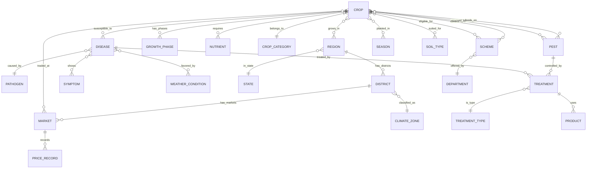

# AI Krushi Mitra — Knowledge Graph Ontology

> **Version:** 1.0 | **Status:** Approved | **Owner:** Knowledge Graph Architect  
> **Last Updated:** 2026-06-28

---

## 1. Core Entity Model



---

## 2. Entity Definitions

### 2.1 Crop Entity

| Attribute | Type | Example |
|-----------|------|---------|
| `id` | string | `soybean` |
| `name` | LocalizedString | `{en: "Soybean", mr: "सोयाबीन", hi: "सोयाबीन"}` |
| `scientificName` | string | `Glycine max` |
| `category` | enum | `oilseed` |
| `family` | string | `Fabaceae` |
| `growthDuration` | number (days) | `100-120` |
| `waterRequirement` | enum | `medium` |
| `optimalPh` | range | `6.0-7.5` |
| `optimalTemp` | range (°C) | `20-30` |
| `msp` | number (₹/quintal) | `4,600` |

**Relationships:**
| Relation | Target Entity | Cardinality | Example |
|----------|--------------|-------------|---------|
| `susceptible_to` | Disease | many-to-many | Soybean → Rust, Mosaic Virus |
| `attacked_by` | Pest | many-to-many | Soybean → Stem Fly, Pod Borer |
| `grows_in` | Region | many-to-many | Soybean → Maharashtra, MP, Rajasthan |
| `planted_in` | Season | many-to-many | Soybean → Kharif |
| `suited_for` | SoilType | many-to-many | Soybean → Black Soil, Red Soil |
| `requires` | Nutrient | many-to-many | Soybean → Nitrogen (via fixation), Phosphorus |
| `traded_at` | Market | many-to-many | Soybean → Indore APMC, Latur APMC |
| `companion_of` | Crop | many-to-many | Soybean → Maize (intercropping) |
| `rotates_with` | Crop | many-to-many | Soybean → Wheat (rotation) |
| `eligible_for` | Scheme | many-to-many | Soybean → PMFBY, MSP Procurement |

### 2.2 Disease Entity

| Attribute | Type | Example |
|-----------|------|---------|
| `id` | string | `soybean-rust` |
| `name` | LocalizedString | `{en: "Soybean Rust", mr: "सोयाबीन तांबेरा"}` |
| `causativeAgent` | string | `Phakopsora pachyrhizi` |
| `agentType` | enum | `fungal` |
| `severity` | enum | `high` |
| `yieldLoss` | string | `10-80%` |

**Relationships:**
| Relation | Target Entity | Properties |
|----------|--------------|-----------|
| `affects` | Crop | `susceptibility: high/medium/low`, `growthStage: string[]` |
| `caused_by` | Pathogen | `type: fungal/bacterial/viral` |
| `shows` | Symptom | `stage: early/mid/severe` |
| `treated_by` | Treatment | `effectiveness: high/medium/low` |
| `favored_by` | WeatherCondition | `humidity: >80%`, `temp: 18-26°C` |
| `confused_with` | Disease | `distinguishing_feature: string` |

### 2.3 Region Hierarchy

```
India
├── Maharashtra
│   ├── Vidarbha Division
│   │   ├── Nagpur District
│   │   │   ├── Nagpur APMC Market
│   │   │   ├── Climate Zone: Semi-Arid
│   │   │   └── Crops: Cotton, Soybean, Orange
│   │   ├── Yavatmal District
│   │   ├── Amravati District
│   │   └── Wardha District
│   ├── Marathwada Division
│   │   ├── Aurangabad District
│   │   ├── Latur District
│   │   └── Osmanabad District
│   ├── Western Maharashtra
│   │   ├── Pune District
│   │   ├── Nashik District (Grape, Onion hub)
│   │   └── Kolhapur District (Sugarcane hub)
│   └── Konkan Division
│       ├── Ratnagiri District (Mango hub)
│       └── Sindhudurg District
├── Madhya Pradesh
│   ├── Indore (Soybean capital)
│   └── ...
├── Gujarat
│   ├── Rajkot (Cotton, Groundnut)
│   └── ...
└── ... (All 28 states + 8 UTs)
```

---

## 3. Crop Taxonomy

### 3.1 Classification Tree

```
Agricultural Crops
├── Cereals (अन्नधान्य)
│   ├── Rice (भात/चावल) — Kharif
│   ├── Wheat (गहू/गेहूं) — Rabi
│   ├── Maize (मका/मक्का) — Kharif/Rabi
│   ├── Sorghum/Jowar (ज्वारी/ज्वार) — Kharif/Rabi
│   ├── Pearl Millet/Bajra (बाजरी/बाजरा) — Kharif
│   └── Finger Millet/Ragi (नाचणी/रागी) — Kharif
│
├── Pulses (कडधान्य/दालें)
│   ├── Chickpea/Gram (हरभरा/चना) — Rabi
│   ├── Pigeon Pea/Tur (तूर/अरहर) — Kharif
│   ├── Green Gram/Moong (मूग/मूंग) — Kharif/Zaid
│   ├── Black Gram/Urad (उडीद/उड़द) — Kharif
│   └── Lentil/Masur (मसूर) — Rabi
│
├── Oilseeds (तेलबिया)
│   ├── Soybean (सोयाबीन) — Kharif
│   ├── Groundnut (भुईमूग/मूंगफली) — Kharif
│   ├── Mustard (मोहरी/सरसों) — Rabi
│   ├── Sunflower (सूर्यफूल) — Rabi/Zaid
│   └── Sesame (तीळ/तिल) — Kharif
│
├── Cash Crops (नगदी पिके)
│   ├── Sugarcane (ऊस/गन्ना) — Annual
│   ├── Cotton (कापूस/कपास) — Kharif
│   ├── Tobacco (तंबाखू) — Rabi
│   └── Jute (ताग/जूट) — Kharif
│
├── Vegetables (भाजीपाला/सब्जियां)
│   ├── Onion (कांदा/प्याज) — Rabi/Kharif
│   ├── Tomato (टोमॅटो/टमाटर) — All seasons
│   ├── Potato (बटाटा/आलू) — Rabi
│   ├── Chili (मिरची/मिर्च) — Kharif
│   ├── Brinjal (वांगी/बैंगन) — All seasons
│   └── Okra (भेंडी/भिंडी) — Kharif/Zaid
│
├── Fruits (फळे/फल)
│   ├── Mango (आंबा/आम) — Perennial
│   ├── Grape (द्राक्ष/अंगूर) — Perennial
│   ├── Pomegranate (डाळिंब/अनार) — Perennial
│   ├── Banana (केळी/केला) — Perennial
│   ├── Orange (संत्रा/संतरा) — Perennial
│   └── Guava (पेरू/अमरूद) — Perennial
│
└── Spices (मसाले)
    ├── Turmeric (हळद/हल्दी) — Kharif
    ├── Ginger (आले/अदरक) — Kharif
    └── Coriander (धणे/धनिया) — Rabi
```

---

## 4. Disease Taxonomy

```
Plant Diseases
├── Fungal Diseases (बुरशीजन्य रोग)
│   ├── Rusts (तांबेरा)
│   │   ├── Soybean Rust (Phakopsora pachyrhizi)
│   │   ├── Wheat Rust (Puccinia spp.)
│   │   └── Sugarcane Rust (Puccinia melanocephala)
│   ├── Blights (करपा)
│   │   ├── Late Blight (Phytophthora infestans) — Potato, Tomato
│   │   ├── Early Blight (Alternaria solani) — Potato, Tomato
│   │   └── Bacterial Blight (Xanthomonas) — Cotton, Rice
│   ├── Wilts (मर रोग)
│   │   ├── Fusarium Wilt — Chickpea, Banana, Tomato
│   │   └── Verticillium Wilt — Cotton, Brinjal
│   ├── Rots (सड)
│   │   ├── Root Rot — Soybean, Chickpea
│   │   ├── Fruit Rot — Pomegranate, Chili
│   │   └── Red Rot — Sugarcane
│   ├── Powdery Mildew (भुरी) — Grape, Pea, Wheat
│   ├── Downy Mildew (डाउनी मिल्ड्यू) — Grape, Pearl Millet
│   └── Anthracnose (करपा) — Mango, Chili, Pomegranate
│
├── Bacterial Diseases (जिवाणूजन्य रोग)
│   ├── Bacterial Leaf Blight — Rice
│   ├── Citrus Canker — Orange, Lemon
│   ├── Black Rot — Grape
│   └── Bacterial Wilt — Tomato, Brinjal
│
├── Viral Diseases (विषाणूजन्य रोग)
│   ├── Yellow Mosaic Virus — Soybean, Moong
│   ├── Leaf Curl Virus — Tomato, Chili
│   ├── Bunchy Top Virus — Banana
│   └── Sugarcane Mosaic Virus — Sugarcane
│
├── Nematode Diseases (सूत्रकृमी)
│   ├── Root-Knot Nematode — Tomato, Brinjal
│   └── Cyst Nematode — Soybean, Wheat
│
└── Nutrient Deficiencies (पोषक तत्वांची कमतरता)
    ├── Nitrogen Deficiency — Yellowing of older leaves
    ├── Phosphorus Deficiency — Purple discoloration
    ├── Potassium Deficiency — Leaf edge browning
    ├── Iron Deficiency (Chlorosis) — Interveinal yellowing
    ├── Zinc Deficiency — White leaf tips
    └── Boron Deficiency — Hollow heart, cracking
```

---

## 5. Glossary (Trilingual)

| English | Marathi (मराठी) | Hindi (हिंदी) | Context |
|---------|-----------------|---------------|---------|
| Sowing | पेरणी | बुआई | Crop calendar phase |
| Harvesting | काढणी | कटाई | Crop calendar phase |
| Germination | उगवण | अंकुरण | Growth stage |
| Flowering | फुलोरा | फूल आना | Growth stage |
| Tillering | फुटवे | कल्ले | Rice/wheat growth |
| Irrigation | सिंचन | सिंचाई | Water management |
| Fertilizer | खत | उर्वरक | Input |
| Pesticide | कीटकनाशक | कीटनाशक | Input |
| Fungicide | बुरशीनाशक | फफूंदनाशक | Input |
| Herbicide | तणनाशक | खरपतवारनाशक | Input |
| Organic manure | सेंद्रिय खत | जैविक खाद | Input |
| Seed treatment | बीजप्रक्रिया | बीजोपचार | Pre-sowing |
| Spraying | फवारणी | छिड़काव | Application |
| Drip irrigation | ठिबक सिंचन | टपक सिंचाई | Irrigation type |
| Soil testing | माती परीक्षण | मिट्टी जाँच | Analysis |
| Quintal | क्विंटल | क्विंटल | Market unit (100 kg) |
| Acre | एकर | एकड़ | Land unit |
| Hectare | हेक्टर | हेक्टेयर | Land unit |
| Mandi | बाजार | मंडी | Market |
| FPO | शेतकरी उत्पादक कंपनी | किसान उत्पादक संगठन | Organization |
| MSP | किमान आधारभूत किंमत | न्यूनतम समर्थन मूल्य | Government pricing |
| APMC | कृषी उत्पन्न बाजार समिती | कृषि उपज मंडी समिति | Market regulation |
