# AI Krushi Mitra — Business Model Specification

> **Version:** 1.0 | **Status:** Approved | **Owner:** Product Strategy Agent  
> **Last Updated:** 2026-06-28

---

## 1. Business Model Canvas

```mermaid
graph TD
    subgraph Partners [Key Partners]
        KP1["State Departments of Agriculture"]
        KP2["NABARD & Rural Banks"]
        KP3["Krishi Vigyan Kendras (KVKs)"]
        KP4["Farmer Producer Organizations (FPOs)"]
        KP5["Input Brand Partners (Seeds, Fertilizers)"]
    end

    subgraph Activities [Key Activities]
        KA1["AI Model Training (Disease Vision, Voice NLP)"]
        KA2["APMC Mandi Bhav Data Aggregation"]
        KA3["Offline-First App Engineering"]
        KA4["KVK/FPO Onboarding & Local Engagement"]
    end

    subgraph Value [Value Propositions]
        VP1["Instant Leaf-Scan Disease Diagnosis (Marathi/Hindi)"]
        VP2["Grounded RAG Farming Expert Advice"]
        VP3["Real-time Local Mandi Price (Bhav) Feeds"]
        VP4["One-tap Voice Assistant for Low Literacy Farmers"]
    end

    subgraph Relations [Customer Relationships]
        CR1["Community Trust (Native Language Voice)"]
        CR2["Cooperative Partnerships (FPOs)"]
        CR3["Government Endorsements (State Portals)"]
    end

    subgraph Segments [Customer Segments]
        CS1["Smallholder Farmers (1-5 Acres, Low Literacy)"]
        CS2["Progressive Farmers (Familiar with digital apps)"]
        CS3["FPOs & Co-ops (Aggregated advisory/inputs)"]
        CS4["Agri-Input Retailers (Pesticide/Seed Dealers)"]
    end

    subgraph Resources [Key Resources]
        KR1["Gemini AI Multimodal & Embedding Models"]
        KR2["Verified Crop Database (ICAR/KVK guides)"]
        KR3["Developer & Agronomist Teams"]
    end

    subgraph Channels [Channels]
        CH1["WhatsApp Communities & Shared Alerts"]
        CH2["FPO Network & Physical Onboarding"]
        CH3["Google Play Store (Optimized APK Size)"]
        CH4["Rural Agro-Input Retail Outlets"]
    end

    subgraph Costs [Cost Structure]
        CO1["AI Token Usage (Vision & Audio API)"]
        CO2["APMC Data Scraping & Pipeline Maintenance"]
        CO3["Engineering & Development Staff"]
        CO4["FPO Field Partner Commissions"]
    end

    subgraph Revenue [Revenue Streams]
        RE1["FPO Aggregated SaaS Dashboard (Subscription)"]
        RE2["Input Brand Sponsorships & Marketplace Lead Gen"]
        RE3["Premium Farmer Advisory Subscriptions (Rs 99/mo)"]
    end
```

---

## 2. Customer Segments Deep-Dive

### 2.1 Smallholder Marginal Farmers (70% of Base)
- **Landholding:** < 2 Hectares
- **Main Crops:** Cotton, Soybean, Onions, Paddy
- **Key Need:** Direct pest/disease identification and immediate organic remedies to reduce costs.

### 2.2 Progressive & Commercial Farmers (20% of Base)
- **Landholding:** 2-5 Hectares
- **Main Crops:** Pomegranate, Grapes, Sugarcane, High-value Vegetables
- **Key Need:** Soil report analysis, precision micro-irrigation schedules, and export market pricing metrics.

### 2.3 Farmer Producer Organizations (FPOs) & Cooperatives (10% of Base)
- **Aggregated Acreage:** 100 - 1,000+ Hectares per cluster
- **Key Need:** Group advisories, input demand aggregation, and centralized market connection pipelines.

---

## 3. Revenue Architecture

| Stream | Model | Target | Cost | Value Provided |
|--------|-------|--------|------|----------------|
| **Premium Advisory** | B2C Subscription | Progressive Farmers | ₹99 / month | Soil health interpretation, expert consultations, personalized alerts. |
| **FPO Aggregator** | B2B SaaS | FPO Management | ₹2,500 / month | Unified member management, bulk input request coordinator, shared tractor/implement renting dashboard. |
| **Brand Sponsorship** | Lead Generation | Input Dealers / Brands | CPC / Lead fee | Target crop alerts recommend specific branded fertilizers/seeds based on soil deficiency. |
