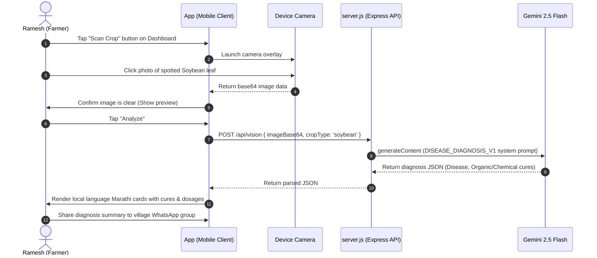
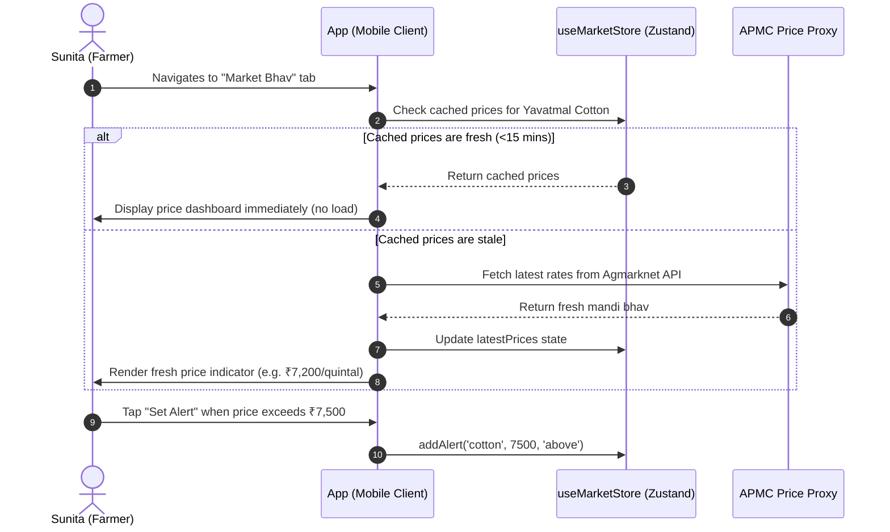
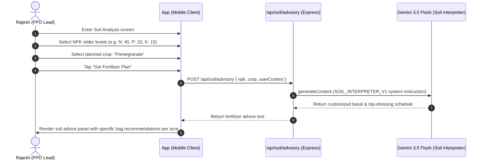

# AI Krushi Mitra — Extended User Journeys

> **Version:** 1.0 | **Status:** Approved | **Owner:** Product Strategy Agent  
> **Last Updated:** 2026-06-28

---

## 1. Disease Detection User Journey (Ramesh)

---

## 2. Market Price Check & Alert Journey (Sunita)

---

## 3. Soil Test Report Analysis Journey (Rajesh)

