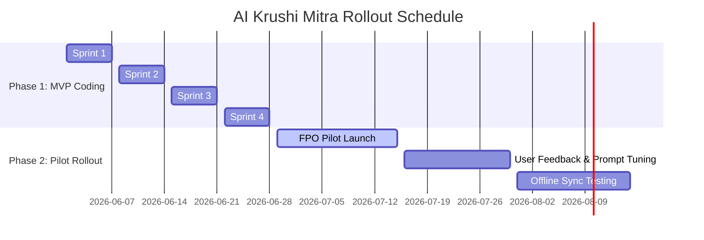

# AI Krushi Mitra — Sprint Backlog Roadmap

> **Version:** 1.0 | **Status:** Approved | **Owner:** Product Owner  
> **Last Updated:** 2026-06-28

---

## 1. Complete Roadmap Breakdown

---

## 2. Sprint Backlog Details

*   **Phase 1 (Complete):** High fidelity design systems, state persistence, RAG pipeline, vision diagnosis, live schemes matcher, and soil test advisors.
*   **Phase 2 (Upcoming):** Focus on localized onboarding campaigns, telemetry tracking, offline sync validations, and SMS verification integration.
