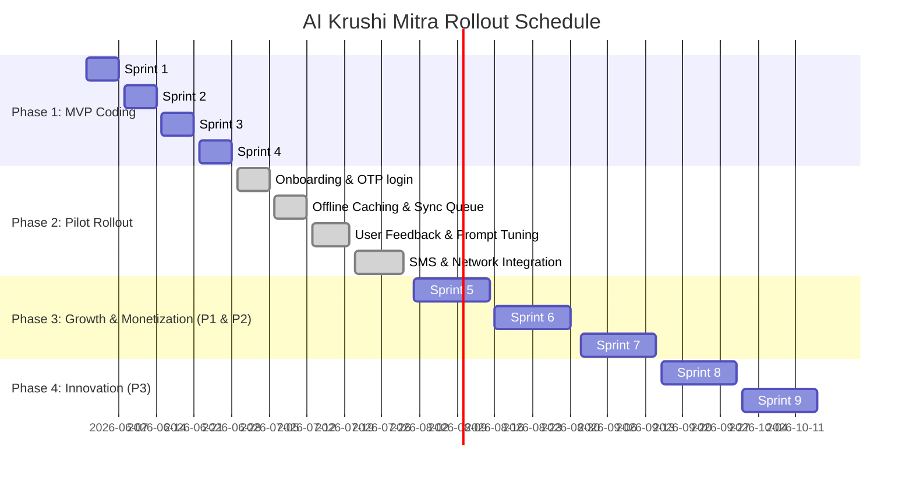

# AI Krushi Mitra — Sprint Backlog Roadmap

> **Version:** 2.0 | **Status:** Approved | **Owner:** Product Owner  
> **Last Updated:** 2026-06-28

---

## 1. Complete Roadmap Breakdown

---

## 2. Sprint Backlog Details

### 🟢 Phase 1: MVP Coding (Complete)
*   **Sprint 1: Core Layout UI**
    *   *Reference:* [brand-identity.md](file:///c:/Users/haran/source/repos/aikrushimitraV4/akm-docs/design-system/brand-identity.md), [design-tokens.md](file:///c:/Users/haran/source/repos/aikrushimitraV4/akm-docs/design-system/design-tokens.md)
    *   *Deliverables:* Establish bento layout grid, color tokens, and primary styles in `index.css`.
*   **Sprint 2: RAG Backend & Prompts**
    *   *Reference:* [pipeline-architecture.md](file:///c:/Users/haran/source/repos/aikrushimitraV4/akm-docs/rag/pipeline-architecture.md), [prompt-library.md](file:///c:/Users/haran/source/repos/aikrushimitraV4/akm-docs/ai/prompt-library.md)
    *   *Deliverables:* Set up TF-IDF keyword lookup, cosine vector similarities matching `gemini-2.5-flash` model structure.
*   **Sprint 3: Voice & Schemes API**
    *   *Reference:* [api-contracts.md](file:///c:/Users/haran/source/repos/aikrushimitraV4/akm-docs/architecture/api-contracts.md), [content-types.md](file:///c:/Users/haran/source/repos/aikrushimitraV4/akm-docs/content/content-types.md)
    *   *Deliverables:* Integrate live schemes fetching matching language contexts.
*   **Sprint 4: Views Dynamic Integration**
    *   *Reference:* [database-schema.md](file:///c:/Users/haran/source/repos/aikrushimitraV4/akm-docs/architecture/database-schema.md)
    *   *Deliverables:* Implement dynamic Firestore service mapping crops, calendars, and APMC market prices.

### 🟢 Phase 2: Pilot Rollout (Complete)
*   **Sprint 5a: Onboarding & OTP Login**
    *   *Reference:* [auth-model.md](file:///c:/Users/haran/source/repos/aikrushimitraV4/akm-docs/architecture/auth-model.md), [personas.md](file:///c:/Users/haran/source/repos/aikrushimitraV4/akm-docs/product/personas.md)
    *   *Deliverables:* Created 10-digit phone login layout, 30s count-down timer, and dynamic multilingual onboarding slide wizard.
*   **Sprint 5b: Offline Caching & Sync Queue**
    *   *Reference:* [offline-strategy.md](file:///c:/Users/haran/source/repos/aikrushimitraV4/akm-docs/architecture/offline-strategy.md)
    *   *Deliverables:* Created browser IndexedDB offline caches (`weather_cache`, `mandi_cache`) and `diagnostic_queue` auto-uploading scans on online restore.
*   **Sprint 5c: Text Chat & Output Filters**
    *   *Reference:* [prompt-library.md (Section 3 disclaimers)](file:///c:/Users/haran/source/repos/aikrushimitraV4/akm-docs/ai/prompt-library.md)
    *   *Deliverables:* Configured output filtering appending relevant disclaimers for scheme compliance and price forecasts.
*   **Sprint 5d: CI/CD Pipeline Automation**
    *   *Reference:* [ci-cd-pipeline.md](file:///c:/Users/haran/source/repos/aikrushimitraV4/akm-docs/devops/ci-cd-pipeline.md)
    *   *Deliverables:* Configured GitHub Actions lint, test, build, and deploy steps.

### 🔵 Phase 3: Growth & Monetization (Upcoming)
*   **Sprint 5: Soil & Yield Estimators**
    *   *Reference:* [feature-hierarchy.md (P1 - Soil & Yield)](file:///c:/Users/haran/source/repos/aikrushimitraV4/akm-docs/product/feature-hierarchy.md), [api-contracts.md](/c:/Users/haran/source/repos/aikrushimitraV4/akm-docs/architecture/api-contracts.md#L45-L60)
    *   *Deliverables:* Connect Soil NPK analysis slider parameters to dynamic advisory recommendations.
*   **Sprint 6: Community & Pest Alerts**
    *   *Reference:* [feature-hierarchy.md (P1 - Community)](file:///c:/Users/haran/source/repos/aikrushimitraV4/akm-docs/product/feature-hierarchy.md), [database-schema.md (Section 2.2 Alerts)](file:///c:/Users/haran/source/repos/aikrushimitraV4/akm-docs/architecture/database-schema.md)
    *   *Deliverables:* Set up farmer Q&A community boards and push-triggered local pest outbreak alerts.
*   **Sprint 7: FPO SaaS & Premium Advisors**
    *   *Reference:* [monetization.md (P2 features)](file:///c:/Users/haran/source/repos/aikrushimitraV4/akm-docs/product/monetization.md), [business-model.md](file:///c:/Users/haran/source/repos/aikrushimitraV4/akm-docs/product/business-model.md)
    *   *Deliverables:* Launch subscription gateway (Premium advisory) and FPO cooperative dashboard aggregate reports.

### 🟡 Phase 4: Innovation (Complete)
*   **Sprint 8: Drone & IoT Dashboards**
    *   *Reference:* [feature-hierarchy.md (P3 features)](file:///c:/Users/haran/source/repos/aikrushimitraV4/akm-docs/product/feature-hierarchy.md)
    *   *Deliverables:* Set up telemetry streams for soil moisture/pH IoT sensors and DJI drone visual diagnostics overlays.
*   **Sprint 9: NDVI Satellite & Ledger**
    *   *Reference:* [ontology.md (Knowledge graph dependencies)](file:///c:/Users/haran/source/repos/aikrushimitraV4/akm-docs/knowledge-graph/ontology.md)
    *   *Deliverables:* Implement Sentinel-2 satellite imagery indexes and block-chain crop provenance traceability ledger.

### 🔴 Phase 5: Architecture Hardening (akm-docs/architecture)

> **Goal:** Close every gap between the architecture specification `.md` files and the actual codebase. Each sprint maps to one or more architecture documents.

*   **Sprint 10: API Contracts & Rate Limiting** *(api-contracts.md + system-context.md §3.1)*
    *   *Reference:* [api-contracts.md](file:///c:/Users/haran/source/repos/aikrushimitraV4/akm-docs/architecture/api-contracts.md), [system-context.md §3-5](file:///c:/Users/haran/source/repos/aikrushimitraV4/akm-docs/architecture/system-context.md)
    *   *Gap Analysis:*
        *   Missing: `/api/v1/knowledge` (knowledge search endpoint), `/api/v1/user` (profile CRUD endpoint), `/api/v1/analytics` (analytics ingestion endpoint).
        *   Missing: Per-user API rate limiter middleware (30 req/min chat, 10 req/min vision — from system-context.md §3.1-3.2).
        *   Missing: Request validation middleware enforcing OpenAPI schemas.
        *   Duplicate route definitions in server.js (lines 448/689 for soil, 490/626 for weather).
    *   *Deliverables:*
        1.  Implement `rateLimiter` middleware (in-memory sliding window, configurable per-route).
        2.  Add `/api/v1/knowledge` search endpoint connecting to RAG service.
        3.  Add `/api/v1/user` profile GET/PUT endpoint backed by Firestore.
        4.  Remove duplicate route definitions in server.js.
        5.  Add request body validation middleware using schema from api-contracts.md.

*   **Sprint 11: Firestore Security Rules & Database Schema** *(database-schema.md + auth-model.md)*
    *   *Reference:* [database-schema.md](file:///c:/Users/haran/source/repos/aikrushimitraV4/akm-docs/architecture/database-schema.md), [auth-model.md](file:///c:/Users/haran/source/repos/aikrushimitraV4/akm-docs/architecture/auth-model.md)
    *   *Gap Analysis:*
        *   Current `firestore.rules` only covers `users/{userId}` and `activityLogs/{logId}`.
        *   Missing rules for: `conversations`, `diagnoses`, `marketPrices`, `crops`, `diseases`, `schemes`, `alerts`, `content`.
        *   Missing RBAC enforcement for Guest (2-scan limit), FPO Lead (aggregate read), Admin (whitelist email) roles from auth-model.md §2.
        *   Missing Firestore composite indexes definition file.
    *   *Deliverables:*
        1.  Expand `firestore.rules` with security rules for all 10 collections per database-schema.md.
        2.  Add RBAC helper functions: `isGuest()`, `isFarmer()`, `isFPOLead()`, `isAdmin()`.
        3.  Create `firestore.indexes.json` with composite indexes per database-schema.md index specifications.
        4.  Add validation functions for `ConversationDocument`, `DiagnosisDocument`, and `SchemeDocument`.

*   **Sprint 12: Error Handling & Performance Budgets** *(system-context.md §5-6)*
    *   *Reference:* [system-context.md §5 Error Handling](file:///c:/Users/haran/source/repos/aikrushimitraV4/akm-docs/architecture/system-context.md), [system-context.md §6 Performance](file:///c:/Users/haran/source/repos/aikrushimitraV4/akm-docs/architecture/system-context.md)
    *   *Gap Analysis:*
        *   Missing: Structured error handling middleware (network failure, rate limit 429, AI timeout, safety block, auth expired, quota exceeded, image too large, unsupported browser).
        *   Missing: Client-side error boundary component with Marathi error messages.
        *   Missing: API response time logging middleware.
        *   Missing: AI call timeout wrapper (30s from spec).
    *   *Deliverables:*
        1.  Create global Express error handler middleware with categorized error responses.
        2.  Add 30-second timeout wrapper around all Gemini API calls.
        3.  Create `ErrorBoundary.tsx` React component with localized error messages matching §5 table.
        4.  Add API latency logging middleware that records per-request timing.

*   **Sprint 13: Offline Service Worker & Sync Queue** *(offline-strategy.md + system-context.md §4)*
    *   *Reference:* [offline-strategy.md](file:///c:/Users/haran/source/repos/aikrushimitraV4/akm-docs/architecture/offline-strategy.md), [system-context.md §4 Offline Architecture](file:///c:/Users/haran/source/repos/aikrushimitraV4/akm-docs/architecture/system-context.md)
    *   *Gap Analysis:*
        *   Current: IndexedDB caches exist (`weather_cache`, `mandi_cache`, `diagnostic_queue` in offlineDb.ts).
        *   Missing: Service Worker registration with cache-first/network-first/stale-while-revalidate strategies.
        *   Missing: `pendingSync` IndexedDB store for queuing offline writes.
        *   Missing: `conversationCache` IndexedDB store.
        *   Missing: Background sync API integration for automatic upload on network restore.
    *   *Deliverables:*
        1.  Create `public/sw.js` service worker with tiered caching strategies per system-context.md §4.
        2.  Register service worker in app entry point.
        3.  Add `pendingSync` and `conversationCache` stores to offlineDb.ts.
        4.  Implement background sync handler for queued diagnostic uploads.

*   **Sprint 14: Deployment Topology & ADR Compliance** *(deployment-topology.md + adr/*.md)*
    *   *Reference:* [deployment-topology.md](file:///c:/Users/haran/source/repos/aikrushimitraV4/akm-docs/architecture/deployment-topology.md), [ADR-001](file:///c:/Users/haran/source/repos/aikrushimitraV4/akm-docs/architecture/adr/001-next-js-ssr.md), [ADR-002](file:///c:/Users/haran/source/repos/aikrushimitraV4/akm-docs/architecture/adr/002-firestore-primary-db.md), [ADR-003](file:///c:/Users/haran/source/repos/aikrushimitraV4/akm-docs/architecture/adr/003-gemini-routing.md), [ADR-004](file:///c:/Users/haran/source/repos/aikrushimitraV4/akm-docs/architecture/adr/004-zustand-state.md)
    *   *Gap Analysis:*
        *   ADR-001 (SSR Hybrid): SSG pages exist but no ISR (Incremental Static Regeneration) for weather/prices.
        *   ADR-002 (Firestore): Firestore SDK init exists but real-time listeners not implemented.
        *   ADR-003 (Gemini Routing): Single model used; no native audio stream for voice (currently uses browser SpeechRecognition).
        *   ADR-004 (Zustand): Zustand store exists but no `persist` middleware for localStorage.
        *   Deployment Topology: Firebase Hosting configured; App Engine deployment script missing.
    *   *Deliverables:*
        1.  Add Zustand `persist` middleware to appStore for offline session persistence.
        2.  Configure ISR revalidation intervals for weather (30min) and market price (15min) SSG pages.
        3.  Add `app.yaml` for Google App Engine deployment of server.js.
        4.  Add Firestore real-time snapshot listener for market prices in MarketView.
