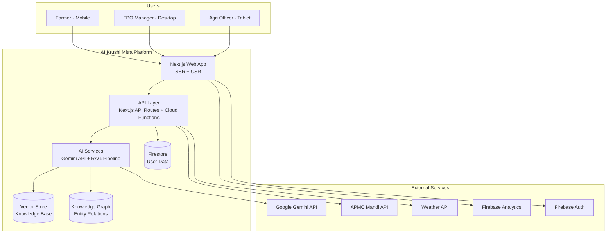

# 🚀 AI Krushi Mitra — Phase 0: Enterprise Architecture & AI Platform Blueprint

> **Domain:** [aikrushimitra.in](https://aikrushimitra.in) | **Project:** aikrushimitrav1  
> **Goal:** Produce a complete specification where every feature, API, screen, AI workflow, database entity, design token, and SEO strategy is defined **before production code begins.**

---

## Current State Audit

Before planning forward, here is what exists today in [aikrushimitraV4](file:///c:/Users/haran/source/repos/aikrushimitraV4):

### What's Built (V4 Prototype)
| Layer | Status | Files |
|-------|--------|-------|
| **Landing Page (SSR)** | ✅ Next.js static export with SEO pages | [app/page.tsx](file:///c:/Users/haran/source/repos/aikrushimitraV4/app/page.tsx), [LandingPage.tsx](file:///c:/Users/haran/source/repos/aikrushimitraV4/components/views/LandingPage.tsx) |
| **App SPA (Client)** | ✅ React SPA under `/app` route | [App.tsx](file:///c:/Users/haran/source/repos/aikrushimitraV4/App.tsx), 19 view components |
| **AI Chat/Vision** | ✅ Gemini 2.5 Flash via proxy server | [geminiService.ts](file:///c:/Users/haran/source/repos/aikrushimitraV4/services/geminiService.ts), [server.js](file:///c:/Users/haran/source/repos/aikrushimitraV4/server.js) |
| **Voice Assistant** | ✅ WebSocket streaming + TTS/STT | [VoiceAssistant.tsx](file:///c:/Users/haran/source/repos/aikrushimitraV4/components/views/VoiceAssistant.tsx) (54KB) |
| **Disease Detection** | ✅ Camera-based image analysis | [DiseaseDetector.tsx](file:///c:/Users/haran/source/repos/aikrushimitraV4/components/views/DiseaseDetector.tsx) |
| **Auth** | ✅ Google OAuth + Guest mode | [LoginView.tsx](file:///c:/Users/haran/source/repos/aikrushimitraV4/components/views/LoginView.tsx) |
| **Firestore** | ✅ User profiles + Activity logs | [firebase.ts](file:///c:/Users/haran/source/repos/aikrushimitraV4/utils/firebase.ts), [firestore.rules](file:///c:/Users/haran/source/repos/aikrushimitraV4/firestore.rules) |
| **Analytics** | ⚠️ Partially wired (config key issue) | [analyticsService.ts](file:///c:/Users/haran/source/repos/aikrushimitraV4/services/analyticsService.ts) |
| **pSEO Pages** | ✅ Crops, Diseases, Mandi Bhav | [app/crops/](file:///c:/Users/haran/source/repos/aikrushimitraV4/app/crops), [app/diseases/](file:///c:/Users/haran/source/repos/aikrushimitraV4/app/diseases), [app/mandi-bhav/](file:///c:/Users/haran/source/repos/aikrushimitraV4/app/mandi-bhav) |
| **Static Data** | ⚠️ Hardcoded in [constants.ts](file:///c:/Users/haran/source/repos/aikrushimitraV4/constants.ts) (348KB!) | [knowledge.ts](file:///c:/Users/haran/source/repos/aikrushimitraV4/data/knowledge.ts), [mock.ts](file:///c:/Users/haran/source/repos/aikrushimitraV4/data/mock.ts) |

### Critical Gaps Identified
1. **No RAG pipeline** — All crop/disease/scheme knowledge is hardcoded in a 348KB constants file
2. **No knowledge graph** — Relationships between crops, diseases, pests, weather are flat arrays
3. **No backend API layer** — Single monolithic [server.js](file:///c:/Users/haran/source/repos/aikrushimitraV4/server.js) (710 lines) handles everything
4. **No offline support** — No service worker, no local caching strategy
5. **No test coverage** — Zero test files exist
6. **No CI/CD pipeline** — Manual deployments only
7. **Mixed architecture** — Vite config + Next.js config coexist, causing build confusion
8. **No proper state management** — useState chains across 19 views in a single App.tsx
9. **No content management** — All content is baked into source code
10. **No proper i18n** — Language support exists but translations are inline

---

## Phase 0 Execution Plan

### Proposed Repository Structure

```
aikrushimitra/
├── akm-docs/                          # Strategic documentation (this Phase 0)
│   ├── product/
│   │   ├── vision.md                  # Vision, mission, value proposition
│   │   ├── personas.md                # Target user personas
│   │   ├── user-journeys.md           # Complete user journey maps
│   │   ├── business-model.md          # Business model canvas
│   │   ├── feature-hierarchy.md       # Prioritized feature tree
│   │   └── monetization.md            # Revenue roadmap
│   ├── architecture/
│   │   ├── system-context.md          # C4 System Context diagram
│   │   ├── container-diagram.md       # Service boundaries
│   │   ├── adr/                       # Architecture Decision Records
│   │   │   ├── 001-next-js-ssr.md
│   │   │   ├── 002-firestore-vs-postgres.md
│   │   │   ├── 003-gemini-routing.md
│   │   │   └── ...
│   │   ├── api-contracts.md           # REST/GraphQL specifications
│   │   ├── auth-model.md              # Authentication & authorization
│   │   ├── offline-strategy.md        # Service worker + sync
│   │   ├── error-handling.md          # Error taxonomy & recovery
│   │   └── deployment-topology.md     # Infrastructure diagram
│   ├── ai/
│   │   ├── llm-routing.md             # Model selection & fallback
│   │   ├── prompt-library.md          # All system prompts versioned
│   │   ├── memory-strategy.md         # Context window management
│   │   ├── tool-invocation.md         # Function calling specs
│   │   ├── safety-guardrails.md       # Content filtering rules
│   │   └── cost-optimization.md       # Token budgeting
│   ├── rag/
│   │   ├── pipeline-architecture.md   # End-to-end RAG design
│   │   ├── source-catalog.md          # Data sources for ingestion
│   │   ├── chunking-strategy.md       # Document splitting rules
│   │   ├── embedding-model.md         # Model selection + indexing
│   │   ├── retrieval-reranking.md     # Search + rerank pipeline
│   │   └── freshness-cadence.md       # Update scheduling
│   ├── knowledge-graph/
│   │   ├── ontology.md                # Entity & relationship model
│   │   ├── crop-taxonomy.md           # Crop classification tree
│   │   ├── disease-taxonomy.md        # Disease/pest classification
│   │   ├── soil-taxonomy.md           # Soil type hierarchy
│   │   ├── weather-concepts.md        # Weather impact model
│   │   ├── seasonal-calendars.md      # Crop calendar by region
│   │   ├── scheme-categories.md       # Government scheme taxonomy
│   │   └── glossary.md                # Marathi/Hindi/English terms
│   ├── design-system/
│   │   ├── brand-identity.md          # Logo, voice, personality
│   │   ├── color-tokens.md            # Complete color palette
│   │   ├── typography.md              # Font stack & scale
│   │   ├── spacing-scale.md           # 4px grid system
│   │   ├── iconography.md             # Icon library spec
│   │   ├── motion-guidelines.md       # Animation principles
│   │   ├── component-library.md       # Component specs with states
│   │   └── accessibility.md           # WCAG + rural accessibility
│   ├── seo/
│   │   ├── rendering-strategy.md      # SSR/SSG/ISR decisions
│   │   ├── url-architecture.md        # URL taxonomy & canonicals
│   │   ├── structured-data.md         # Schema.org markup plan
│   │   ├── sitemap-strategy.md        # Sitemap generation rules
│   │   ├── performance-budget.md      # Core Web Vitals targets
│   │   └── topic-clusters.md          # Content hub strategy
│   ├── content/
│   │   ├── content-types.md           # Content model definitions
│   │   ├── editorial-calendar.md      # Publishing schedule
│   │   ├── localization.md            # i18n strategy (12 languages)
│   │   ├── review-workflow.md         # Expert review process
│   │   └── internal-linking.md        # Link topology rules
│   ├── security/
│   │   ├── threat-model.md            # STRIDE analysis
│   │   ├── auth-architecture.md       # OAuth + session management
│   │   ├── firestore-rules.md         # Security rules documentation
│   │   ├── secret-management.md       # Key rotation & storage
│   │   ├── rate-limiting.md           # API abuse prevention
│   │   └── compliance.md              # Privacy, consent, data retention
│   ├── qa/
│   │   ├── test-strategy.md           # Test pyramid definition
│   │   ├── acceptance-criteria.md     # Feature acceptance standards
│   │   ├── device-matrix.md           # Supported devices/browsers
│   │   ├── ai-evaluation.md           # LLM accuracy evaluation
│   │   └── regression-plan.md         # Regression test schedule
│   ├── devops/
│   │   ├── git-workflow.md            # Branching strategy
│   │   ├── ci-cd-pipeline.md          # Build, test, deploy automation
│   │   ├── environments.md            # Dev, staging, production
│   │   ├── monitoring.md              # Observability stack
│   │   └── disaster-recovery.md       # Backup & rollback
│   ├── analytics/
│   │   ├── kpi-framework.md           # Product KPIs
│   │   ├── event-taxonomy.md          # Analytics event catalog
│   │   ├── funnel-definitions.md      # Conversion funnels
│   │   └── ai-usage-metrics.md        # AI feature tracking
│   └── roadmap/
│       ├── sprint-backlog.md          # Initial sprint items
│       ├── risk-register.md           # Known risks & mitigations
│       └── definition-of-done.md      # Quality standards
│
├── akm-app/                           # Production application code
│   ├── web/                           # Next.js web application
│   │   ├── app/                       # Next.js App Router
│   │   │   ├── (landing)/             # SEO landing pages (SSR)
│   │   │   ├── (seo)/                 # pSEO content pages (SSG)
│   │   │   │   ├── crops/
│   │   │   │   ├── diseases/
│   │   │   │   ├── mandi-bhav/
│   │   │   │   └── schemes/
│   │   │   ├── (app)/                 # Client SPA (CSR)
│   │   │   │   ├── dashboard/
│   │   │   │   ├── voice/
│   │   │   │   ├── scan/
│   │   │   │   ├── weather/
│   │   │   │   ├── market/
│   │   │   │   └── profile/
│   │   │   └── api/                   # Next.js API routes
│   │   ├── components/
│   │   │   ├── ui/                    # Design system primitives
│   │   │   ├── features/              # Feature-specific components
│   │   │   └── layout/               # Layout components
│   │   ├── lib/                       # Utilities, Firebase, services
│   │   ├── hooks/                     # Custom React hooks
│   │   ├── store/                     # State management (Zustand)
│   │   ├── styles/                    # Global CSS + design tokens
│   │   └── i18n/                      # Translation files
│   ├── backend/                       # Backend services
│   │   ├── api/                       # Express/Cloud Functions
│   │   ├── services/                  # Business logic
│   │   ├── middleware/                # Auth, rate-limit, logging
│   │   └── workers/                   # Background jobs
│   ├── ai-services/                   # AI pipeline
│   │   ├── prompts/                   # Versioned prompt templates
│   │   ├── rag/                       # RAG pipeline implementation
│   │   ├── knowledge-graph/           # Graph data + queries
│   │   ├── evaluation/               # AI quality testing
│   │   └── tools/                     # Function calling definitions
│   └── shared/                        # Shared types, constants
│       ├── types/
│       ├── constants/
│       └── utils/
```

---

## Program 1 — Product Strategy

### 1.1 Product Vision Document

| Element | Definition |
|---------|-----------|
| **Vision** | Every Indian farmer has an AI-powered agricultural advisor in their pocket — accessible in their language, online or offline, free at the point of use |
| **Mission** | Democratize agricultural knowledge through AI, bridging the gap between research institutions and India's 150M+ farming families |
| **Value Proposition** | One app that replaces 5+ fragmented services: crop advisory, disease identification, market prices, weather forecast, and government scheme discovery — all in the farmer's native language |

### 1.2 Target Personas

| Persona | Profile | Key Needs | Constraints |
|---------|---------|-----------|-------------|
| **Ramesh** (Small Farmer) | 2-5 acre, rainfed, Vidarbha | Disease identification, Mandi prices, PM-KISAN status | 2G/3G, ₹8K phone, Marathi only, low digital literacy |
| **Sunita** (Progressive Farmer) | 10-20 acre, irrigated, Nashik | Yield optimization, soil analysis, export market rates | 4G, mid-range phone, Hindi/Marathi, moderate literacy |
| **Rajesh** (FPO Manager) | Manages 200+ farmers | Aggregate market data, scheme tracking, member advisory | Desktop + phone, English/Hindi, high literacy |
| **Priya** (Input Dealer) | Agri-input shop owner | Disease diagnosis to recommend products, competitor pricing | 4G, budget phone, Hindi, moderate literacy |
| **Dr. Patil** (Agriculture Officer) | Block-level extension worker | Mass advisories, pest outbreak tracking, report generation | Govt device, Hindi/English/Marathi, high literacy |

### 1.3 Feature Hierarchy

```
AI Krushi Mitra
├── 🎯 Core (P0 — Must Ship)
│   ├── AI Chat Assistant (multilingual, voice-first)
│   ├── Crop Disease Detection (camera scan)
│   ├── Live Mandi Bhav (APMC price feed)
│   ├── Weather Forecast (hyperlocal)
│   ├── Crop Calendar (region-specific)
│   └── Government Scheme Discovery
│
├── 📈 Growth (P1 — Next Release)
│   ├── Soil Health Analysis (report upload)
│   ├── Yield Predictor (ML model)
│   ├── Area/Land Calculator (GPS-based)
│   ├── Pest Alert System (push notifications)
│   └── Community Forum (farmer-to-farmer)
│
├── 💰 Monetization (P2 — Revenue)
│   ├── Premium Advisory (expert consultations)
│   ├── Input Marketplace (seeds, fertilizers)
│   ├── Crop Insurance Integration
│   ├── FPO Dashboard (bulk management)
│   └── Sponsored Content (agri-brands)
│
└── 🔮 Future (P3 — Innovation)
    ├── Drone Integration (aerial crop monitoring)
    ├── IoT Sensor Dashboard (soil moisture, pH)
    ├── Blockchain Traceability (farm-to-fork)
    └── Satellite Imagery Analysis (NDVI)
```

---

## Program 2 — Information Architecture

### 2.1 Site Map & URL Architecture

```
aikrushimitra.in/
├── /                                  # Landing page (SSR)
├── /crops/                            # Crop hub index
│   ├── /crops/{crop}/                 # Individual crop guide (SSG)
│   └── /crops/{crop}/{topic}/         # Subtopic (cultivation, diseases, market)
├── /diseases/                         # Disease hub index
│   └── /diseases/{disease}/           # Disease identification guide (SSG)
├── /mandi-bhav/                       # Market rates hub
│   ├── /mandi-bhav/{state}/           # State-level APMC listing
│   │   └── /mandi-bhav/{state}/{district}/{crop}/  # Specific market rate
├── /schemes/                          # Government schemes hub
│   └── /schemes/{scheme-slug}/        # Individual scheme page
├── /weather/                          # Weather landing
│   └── /weather/{state}/{district}/   # District weather page
├── /knowledge/                        # Agricultural knowledge base
│   └── /knowledge/{topic}/            # Topic deep-dive
├── /blog/                             # Blog/editorial content
│   └── /blog/{post-slug}/            # Individual blog post
├── /about/                            # About the platform
├── /contact/                          # Contact & support
├── /privacy/                          # Privacy policy
├── /terms/                            # Terms of service
│
└── /app/                              # Client SPA (CSR) — authenticated
    ├── /app/dashboard/
    ├── /app/voice/
    ├── /app/scan/
    ├── /app/weather/
    ├── /app/market/
    ├── /app/calendar/
    ├── /app/schemes/
    ├── /app/knowledge/
    ├── /app/profile/
    └── /app/admin/
```

### 2.2 Navigation Model

| Context | Primary Nav | Secondary Nav | Actions |
|---------|------------|---------------|---------|
| **Landing (Public)** | Top bar: Home, Features, Crops, Diseases, Mandi Bhav, Blog | Language selector | CTA: "Start Using Free" |
| **App (Authenticated)** | Sidebar (desktop) / Bottom tab (mobile): Dashboard, Voice, Scan, Market, More | Breadcrumb within features | Profile, Notifications, Settings |

---

## Program 3 — Technical Architecture

### 3.1 System Context Diagram



### 3.2 Key Architecture Decisions (ADRs)

| ADR | Decision | Rationale |
|-----|----------|-----------|
| **ADR-001** | Next.js App Router with hybrid rendering | SSR for SEO pages, CSR for app dashboard, SSG for pSEO content |
| **ADR-002** | Firestore as primary database | Already integrated, serverless scaling, offline sync support |
| **ADR-003** | Gemini 2.5 Flash as primary LLM | Best price/performance for Indian agriculture domain, multimodal |
| **ADR-004** | Zustand for client state management | Lightweight, TypeScript-first, replaces useState chains |
| **ADR-005** | Firebase Vertex AI for embeddings | Native Firebase integration, lower latency for RAG |
| **ADR-006** | Server Components for SEO pages | Zero JS shipped for content pages, maximum Core Web Vitals |
| **ADR-007** | Service Worker for offline mode | Critical for rural areas with intermittent connectivity |
| **ADR-008** | Edge Functions for API routes | Sub-100ms latency for chat and market data |

### 3.3 API Contract Specification

```yaml
# Core API Endpoints
/api/v1/chat:
  POST:
    body: { message, lang, context?, imageBase64? }
    response: { reply, citations[], confidence }
    auth: required
    rateLimit: 30/min

/api/v1/vision/diagnose:
  POST:
    body: { imageBase64, mimeType, cropType?, lang }
    response: { disease, confidence, treatment[], preventionSteps[] }
    auth: required
    rateLimit: 10/min

/api/v1/market/prices:
  GET:
    params: { state, district, crop, date? }
    response: { prices[], trend, prediction? }
    auth: optional
    cache: 15min

/api/v1/weather:
  GET:
    params: { lat, lng, lang }
    response: { current, hourly[], daily[], alerts[] }
    auth: optional
    cache: 30min

/api/v1/schemes:
  GET:
    params: { state, category?, lang }
    response: { schemes[], eligibilityCriteria }
    auth: optional
    cache: 24h

/api/v1/crops/{crop}/calendar:
  GET:
    params: { region, season }
    response: { phases[], tasks[], alerts[] }
    auth: optional
    cache: 7d

/api/v1/knowledge/search:
  GET:
    params: { query, lang, limit? }
    response: { results[], facets }
    auth: optional
    cache: 1h

/api/v1/user/profile:
  GET/PUT:
    auth: required
    
/api/v1/user/activity:
  POST:
    body: { event, metadata }
    auth: required
```

### 3.4 Database Schema (Firestore)

```
firestore/
├── users/{userId}
│   ├── name: string
│   ├── email?: string
│   ├── picture?: string
│   ├── village: string
│   ├── district: string
│   ├── state: string
│   ├── landSize: string
│   ├── crops: string[]
│   ├── language: Language
│   ├── deviceInfo: { os, browser, screenSize }
│   ├── joinedAt: timestamp
│   ├── lastLogin: timestamp
│   └── preferences/
│       ├── notifications: boolean
│       ├── offlineMode: boolean
│       └── voiceEnabled: boolean
│
├── activityLogs/{logId}
│   ├── userId: string
│   ├── sessionId: string
│   ├── timestamp: timestamp
│   ├── event: string (enum)
│   ├── view: string
│   ├── action?: string
│   ├── metadata?: map
│   ├── location?: geopoint
│   ├── device: string
│   └── duration?: number
│
├── conversations/{conversationId}
│   ├── userId: string
│   ├── startedAt: timestamp
│   ├── lastMessageAt: timestamp
│   ├── messageCount: number
│   ├── language: Language
│   ├── topic?: string
│   └── messages/ (subcollection)
│       ├── role: 'user' | 'assistant'
│       ├── content: string
│       ├── timestamp: timestamp
│       ├── tokenCount?: number
│       └── citations?: string[]
│
├── diagnoses/{diagnosisId}
│   ├── userId: string
│   ├── imageUrl: string
│   ├── cropType: string
│   ├── disease: string
│   ├── confidence: number
│   ├── treatment: string[]
│   ├── timestamp: timestamp
│   └── feedback?: { helpful: boolean, comment?: string }
│
├── marketPrices/{state}_{district}_{crop}_{date}
│   ├── state: string
│   ├── district: string
│   ├── crop: string
│   ├── date: string
│   ├── modalPrice: number
│   ├── minPrice: number
│   ├── maxPrice: number
│   ├── unit: string
│   ├── source: string
│   └── updatedAt: timestamp
│
├── crops/{cropId}
│   ├── name: map { en, hi, mr, ... }
│   ├── scientificName: string
│   ├── category: string
│   ├── seasons: string[]
│   ├── regions: string[]
│   ├── growthDuration: number
│   ├── waterRequirement: string
│   ├── soilType: string[]
│   ├── diseases: string[] (references)
│   ├── pests: string[] (references)
│   └── calendar: map { sowing, growing, harvesting }
│
├── diseases/{diseaseId}
│   ├── name: map { en, hi, mr, ... }
│   ├── affectedCrops: string[]
│   ├── symptoms: string[]
│   ├── causes: string[]
│   ├── treatment: map { organic, chemical }
│   ├── prevention: string[]
│   ├── images: string[]
│   └── severity: 'low' | 'medium' | 'high' | 'critical'
│
└── schemes/{schemeId}
    ├── name: map { en, hi, mr, ... }
    ├── department: string
    ├── category: string
    ├── eligibility: map
    ├── benefits: string[]
    ├── applicationProcess: string
    ├── deadline?: timestamp
    ├── url: string
    └── states: string[]
```

---

## Program 4 — AI Platform

### 4.1 LLM Routing Strategy

```
User Request
    │
    ├── Text Chat ──────────────► Gemini 2.5 Flash (default)
    │                              ├── Simple Q&A → Direct response
    │                              ├── Complex → RAG-augmented
    │                              └── Safety check → Filter
    │
    ├── Image Analysis ─────────► Gemini 2.5 Flash (multimodal)
    │                              ├── Disease detection
    │                              ├── Soil analysis
    │                              └── Weed identification
    │
    ├── Voice Input ────────────► Speech-to-Text (Google STT)
    │                              └── Transcribe → Route to Text Chat
    │
    └── Structured Query ───────► Direct DB/API (no LLM needed)
                                   ├── Market prices
                                   ├── Weather data
                                   └── Scheme lookup
```

### 4.2 Prompt Library (Versioned)

| Prompt ID | Purpose | Key Elements |
|-----------|---------|--------------|
| `SYSTEM_CHAT_V1` | General agricultural Q&A | Persona: expert agronomist, language-aware, citation-required |
| `SYSTEM_DISEASE_V1` | Disease diagnosis from image | Structured output: disease name, confidence, treatment, prevention |
| `SYSTEM_SOIL_V1` | Soil health interpretation | Parse soil test reports, recommend amendments |
| `SYSTEM_WEATHER_V1` | Weather-based advisories | Correlate forecast with crop calendar, generate actionable alerts |
| `SYSTEM_MARKET_V1` | Market price analysis | Trend interpretation, best-time-to-sell recommendation |
| `SYSTEM_SCHEME_V1` | Government scheme matching | Eligibility assessment, application guidance |

### 4.3 RAG Pipeline Architecture

```
[Data Sources]                    [Ingestion Pipeline]              [Retrieval]
                                  
ICAR Publications ──┐             ┌──────────────────┐             ┌────────────┐
KVK Advisories ─────┤             │ 1. Extraction    │             │ Query      │
State Agri Dept ────┤             │ 2. Cleaning      │             │ Processing │
APEDA Guides ───────┤──────────►  │ 3. Chunking      │──────────►  │ (embed +   │
Weather Bulletins ──┤             │ 4. Metadata tag  │             │  search)   │
Market Reports ─────┤             │ 5. Embedding     │             │            │
Farmer Forums ──────┘             │ 6. Indexing      │             │ Reranking  │
                                  └──────────────────┘             │            │
                                                                   │ Citation   │
                                          ▼                        │ Generation │
                                  ┌──────────────────┐             └─────┬──────┘
                                  │ Vector Store     │◄────────────────┘
                                  │ (Firebase        │
                                  │  Vertex AI)      │
                                  └──────────────────┘
```

### 4.4 Knowledge Graph Ontology

```
Crop ──has──► Disease
  │            │
  │            ├──caused_by──► Pathogen
  │            └──treated_by──► Treatment
  │
  ├──grows_in──► Region
  │               └──has_weather──► Climate Zone
  │
  ├──needs──► Soil Type
  │            └──requires──► Nutrient
  │
  ├──attacked_by──► Pest
  │                  └──controlled_by──► Pesticide
  │
  ├──sold_at──► Market (APMC Mandi)
  │              └──in_district──► District
  │
  └──eligible_for──► Government Scheme
                      └──offered_by──► Department
```

---

## Program 5 — Design System

### 5.1 Color Tokens

```css
/* Primary — Agriculture Green */
--color-primary-50:  #ecfdf5;
--color-primary-100: #d1fae5;
--color-primary-200: #a7f3d0;
--color-primary-300: #6ee7b7;
--color-primary-400: #34d399;
--color-primary-500: #10b981;  /* Primary */
--color-primary-600: #059669;
--color-primary-700: #047857;
--color-primary-800: #065f46;
--color-primary-900: #064e3b;

/* Accent — Earth Amber */
--color-accent-500:  #f59e0b;

/* Semantic */
--color-success: #10b981;
--color-warning: #f59e0b;
--color-error:   #ef4444;
--color-info:    #3b82f6;

/* Surface (Dark Theme) */
--color-bg-primary:    #050505;
--color-bg-secondary:  #0a0a0a;
--color-bg-elevated:   #111111;
--color-bg-card:       #1a1a1a;
--color-border:        rgba(255, 255, 255, 0.08);
--color-text-primary:  #f1f5f9;
--color-text-secondary:#94a3b8;
--color-text-muted:    #64748b;
```

### 5.2 Typography

```css
/* Font Stack */
--font-display: 'Plus Jakarta Sans', sans-serif;  /* Headings */
--font-body:    'Inter', sans-serif;               /* Body text */
--font-mono:    'JetBrains Mono', monospace;        /* Code/data */

/* Scale (Major Third — 1.25) */
--text-xs:   0.75rem;   /* 12px */
--text-sm:   0.875rem;  /* 14px */
--text-base: 1rem;      /* 16px */
--text-lg:   1.125rem;  /* 18px */
--text-xl:   1.25rem;   /* 20px */
--text-2xl:  1.5rem;    /* 24px */
--text-3xl:  1.875rem;  /* 30px */
--text-4xl:  2.25rem;   /* 36px */
--text-5xl:  3rem;      /* 48px */
```

### 5.3 Component Library Spec

Each component must define:

| Component | States | Accessibility | Rural Considerations |
|-----------|--------|---------------|---------------------|
| **Button** | Default, Hover, Active, Disabled, Loading | Focus ring, aria-label, min 44px touch | Large text, high contrast |
| **Card** | Default, Hover, Selected, Loading, Error, Empty | aria-role="article" | Minimal data consumption |
| **Input** | Default, Focus, Error, Disabled | Label association, error message | Voice input fallback |
| **Modal** | Open, Closing, Backdrop | Focus trap, escape key, aria-modal | Full-screen on mobile |
| **Toast** | Info, Success, Warning, Error | aria-live="polite", auto-dismiss | Vibration feedback |
| **VoiceOrb** | Idle, Listening, Processing, Speaking, Error | Visual + haptic feedback | Works without screen reading |
| **CropCard** | Default, Selected, Loading | Alt text for crop images | Offline-cached images |
| **PriceTag** | Up, Down, Neutral | Color-blind safe indicators | ₹ symbol always visible |

---

## Program 6 — SEO & Content Strategy

### 6.1 Rendering Strategy

| Page Type | Rendering | Cache | Revalidation |
|-----------|-----------|-------|-------------|
| Landing page `/` | SSR | CDN 1h | On deploy |
| Crop guides `/crops/{crop}/` | SSG | CDN 24h | Weekly rebuild |
| Disease guides `/diseases/{disease}/` | SSG | CDN 24h | Weekly rebuild |
| Mandi Bhav `/mandi-bhav/...` | ISR | CDN 15min | Every 15min |
| Weather pages | ISR | CDN 30min | Every 30min |
| Scheme pages | SSG | CDN 24h | On scheme update |
| Blog posts | SSG | CDN 24h | On publish |
| App dashboard `/app/*` | CSR | No CDN | Client-only |

### 6.2 Target Keyword Clusters

| Cluster | Primary Keyword | Volume | Pages |
|---------|----------------|--------|-------|
| **Mandi Bhav** | "आजचा कांदा भाव" | 100K+/mo | 200+ district/crop combinations |
| **Crop Diseases** | "कापूस रोग ओळख" | 50K+/mo | 50+ disease pages |
| **Farming Guide** | "सोयाबीन लागवड माहिती" | 30K+/mo | 30+ crop guides |
| **Govt Schemes** | "PM किसान योजना" | 200K+/mo | 50+ scheme pages |
| **Weather** | "आजचे हवामान {district}" | 80K+/mo | 100+ district pages |

### 6.3 Structured Data Plan

| Page Type | Schema.org Type | Required Properties |
|-----------|----------------|---------------------|
| Landing | WebApplication, Organization | name, description, operatingSystem |
| Crop Guide | Article, HowTo | headline, author, datePublished, steps |
| Disease Guide | MedicalCondition (adapted), Article | name, description, possibleTreatment |
| Mandi Bhav | Dataset, Product | price, priceCurrency, availability |
| Scheme | GovernmentService | name, serviceType, provider |
| Weather | WeatherForecast (custom) | temperature, forecast |

---

## Program 7 — Security & Compliance

### 7.1 Threat Model (STRIDE)

| Threat | Risk | Mitigation |
|--------|------|-----------|
| **Spoofing** | Fake user identity | Firebase Auth with Google OAuth, session validation |
| **Tampering** | Modified API requests | Input validation, Firestore security rules |
| **Repudiation** | Deny actions | Immutable activity logs, audit trail |
| **Info Disclosure** | API key exposure | Server-side key management, `.env` files excluded |
| **DoS** | API abuse | Rate limiting (30 req/min chat, 10 req/min vision) |
| **Elevation** | Admin access | Role-based access, admin check in Firestore rules |

### 7.2 Secret Management

| Secret | Storage | Rotation |
|--------|---------|----------|
| Gemini API Key | Firebase Environment Config / `.env` | 90 days |
| Firebase Client Config | Public (by design) | Never |
| Google OAuth Client ID | Environment variable | Annually |
| Admin credentials | Firebase Auth custom claims | On change |

---

## Program 8 — Quality Engineering

### 8.1 Test Pyramid

```
          ┌──────────┐
          │  E2E (5%) │  Playwright: critical user flows
          ├──────────┤
          │Integration│  API route tests, Firebase emulator
          │  (15%)    │
          ├──────────┤
          │  Unit     │  Components, services, utils
          │  (80%)    │  Vitest + React Testing Library
          └──────────┘
```

### 8.2 AI Evaluation Framework

| Metric | Measurement | Target |
|--------|-------------|--------|
| **Accuracy** | Expert-validated answers vs AI | ≥ 85% correct |
| **Hallucination** | Grounding score (RAG citations) | ≤ 5% unsupported claims |
| **Localization** | Marathi/Hindi fluency rating | ≥ 4/5 native speaker score |
| **Toxicity** | Safety classifier pass rate | ≥ 99.9% safe |
| **Latency** | Time to first token | ≤ 2 seconds (4G) |
| **Cost** | Tokens per conversation | ≤ $0.005 per session |

### 8.3 Device/Browser Matrix

| Device | OS | Browser | Priority |
|--------|-----|---------|----------|
| Redmi/Realme (budget) | Android 10+ | Chrome | P0 |
| Samsung Galaxy A series | Android 11+ | Samsung Internet, Chrome | P0 |
| iPhone SE / iPhone 12 | iOS 15+ | Safari | P1 |
| Desktop | Windows 10+ | Chrome, Edge | P1 |
| Tablet | Android/iPad | Chrome, Safari | P2 |

---

## Program 9 — DevOps

### 9.1 Git Workflow

```
main ─────────────────────────────────────── Production
  │
  ├── develop ────────────────────────────── Integration
  │     │
  │     ├── feature/voice-assistant ──────── Feature branch
  │     ├── feature/rag-pipeline ─────────── Feature branch
  │     └── fix/market-price-bug ─────────── Hotfix branch
  │
  └── release/v1.0.0 ────────────────────── Release candidate
```

### 9.2 CI/CD Pipeline

```
Push to develop
    │
    ├── 1. Lint (ESLint + TypeScript)
    ├── 2. Unit Tests (Vitest)
    ├── 3. Build (next build)
    ├── 4. Integration Tests (Firebase Emulator)
    ├── 5. Lighthouse CI (Core Web Vitals)
    │
    ▼
Merge to main
    │
    ├── 6. E2E Tests (Playwright)
    ├── 7. Security Scan (npm audit)
    ├── 8. Deploy to Staging
    ├── 9. Smoke Tests
    │
    ▼
Manual Approval
    │
    └── 10. Deploy to Production (Firebase Hosting)
```

### 9.3 Environments

| Environment | URL | Purpose | Deploy Trigger |
|-------------|-----|---------|---------------|
| **Development** | localhost:3000 | Local dev | `npm run dev` |
| **Preview** | `pr-{id}.aikrushimitra.dev` | PR preview | PR opened |
| **Staging** | staging.aikrushimitra.in | Pre-production testing | Merge to main |
| **Production** | aikrushimitra.in | Live users | Manual approval |

---

## Program 10 — Analytics

### 10.1 KPI Framework

| Category | Metric | Target (90 day) |
|----------|--------|-----------------|
| **Acquisition** | Monthly Active Users | 10,000 |
| **Activation** | Registration completion rate | ≥ 60% |
| **Engagement** | Avg sessions per week per user | ≥ 3 |
| **Retention** | D7 retention | ≥ 40% |
| **AI Usage** | Chat conversations per user/week | ≥ 2 |
| **Disease Scans** | Scans per user/month | ≥ 4 |
| **Market** | Price checks per user/week | ≥ 5 |
| **SEO** | Organic search impressions/month | 100,000+ |
| **Voice** | Voice session completion rate | ≥ 70% |

### 10.2 Event Taxonomy

```
# Page Views
page_view: { page, referrer, language }

# User Actions
sign_up: { method: 'google' | 'guest' }
login: { method, returning: boolean }
profile_complete: { fields_filled }

# AI Features
chat_message_sent: { language, topic?, length }
chat_response_received: { latency_ms, token_count, cited }
disease_scan_started: { crop_type? }
disease_scan_completed: { disease, confidence, duration_ms }
voice_session_started: { language }
voice_session_ended: { duration_s, turns }

# Content
market_price_viewed: { state, district, crop }
weather_checked: { location }
scheme_viewed: { scheme_id }
crop_guide_read: { crop, read_time_s }

# Errors
api_error: { endpoint, status_code, message }
ai_error: { type: 'timeout' | 'safety' | 'quota', context }
```

---

## Phase 0 Success Checklist

| # | Question | Status |
|---|----------|--------|
| 1 | Does every feature solve a validated farmer problem? | ⬜ Pending persona validation |
| 2 | Is the system architecture stable? | ⬜ Pending ADR review |
| 3 | Are data models defined? | ⬜ Schema above — needs review |
| 4 | Are AI workflows documented? | ⬜ Prompt library needs expansion |
| 5 | Is the RAG pipeline specified? | ⬜ Source catalog needs identification |
| 6 | Is the design system complete enough? | ⬜ Component specs need Figma |
| 7 | Is SEO/content aligned with IA? | ⬜ Keyword research needs validation |
| 8 | Are security, testing, DevOps, analytics plans approved? | ⬜ Pending review |

---

> [!IMPORTANT]
> ## What I Need From You Before Proceeding
> 
> 1. **Repository decision**: Should I create `akm-docs/` and `akm-app/` as **separate repos**, or as **top-level directories** within `aikrushimitraV4`?
> 2. **Priority order**: Which programs should I flesh out into full documents first? (I recommend: Product → Architecture → AI/RAG → Design System)
> 3. **Existing data sources**: Do you have access to any APMC APIs, ICAR publications, or government scheme databases that should feed the RAG pipeline?
> 4. **Team context**: Will this blueprint be executed by AI coding agents only, or is there a human team reviewing deliverables?
> 5. **Firebase project**: Should the production app continue using `aikrushimitrav1` project, or are you setting up a new project for the rebuild?
> 6. **Timeline**: What is the target timeline for completing Phase 0 and beginning Phase 1 production coding?
